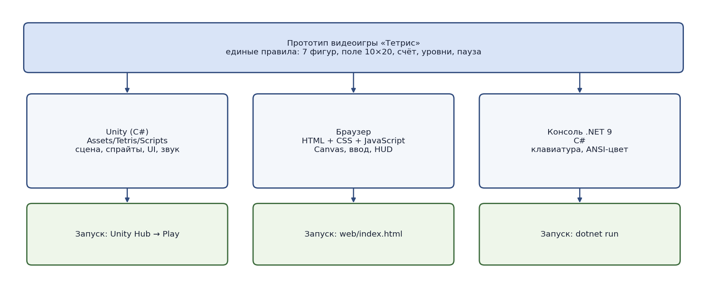
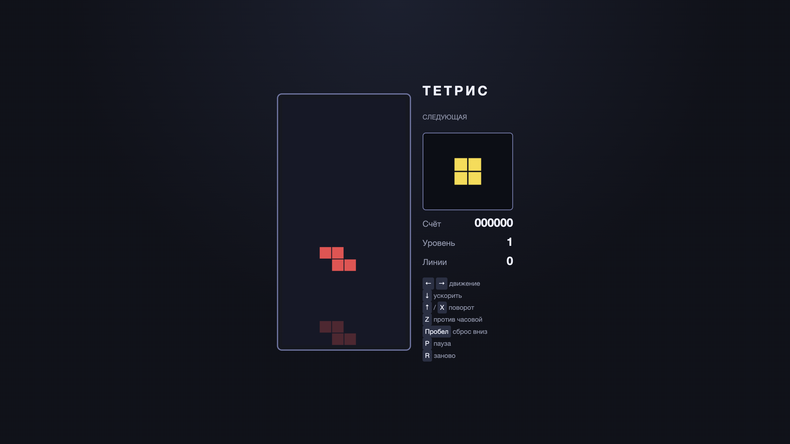
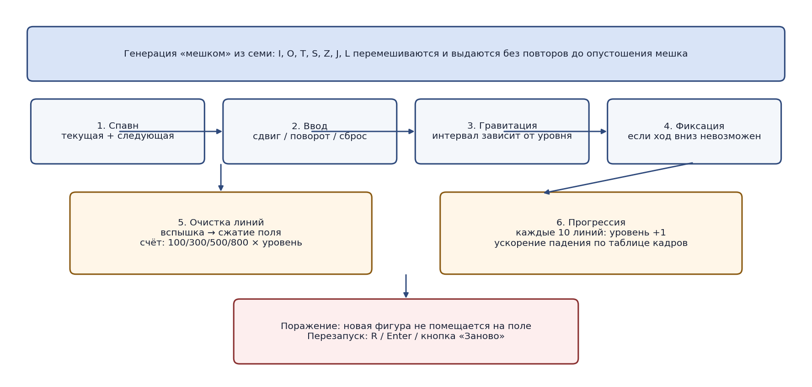

МИНИСТЕРСТВО НАУКИ И ВЫСШЕГО ОБРАЗОВАНИЯ РОССИЙСКОЙ ФЕДЕРАЦИИ

Федеральное государственное автономное образовательное учреждение высшего образования

«КАЗАНСКИЙ (ПРИВОЛЖСКИЙ) ФЕДЕРАЛЬНЫЙ УНИВЕРСИТЕТ»

ИНСТИТУТ ИНФОРМАЦИОННЫХ ТЕХНОЛОГИЙ И ИНТЕЛЛЕКТУАЛЬНЫХ СИСТЕМ

ОТЧЕТ

о прохождении учебной (технологической (проектно-технологической)) практики

Разработка прототипа видеоигры «Тетрис»

Обучающийся: Бутин Иван Михайлович

Группа: 11-307 Подпись: __________

Руководитель практики от КФУ: ____________________

Оценка за практику: __________ ____________________

(подпись руководителя практики)

Дата сдачи отчета: 18.09.2026

Казань -- 2026 г.

# Содержание

[Введение](#введение)

[1 Анализ требований и проектирование архитектуры](#анализ-требований-и-проектирование-архитектуры)

[2 Реализация играбельного прототипа](#реализация-играбельного-прототипа)

[3 Прогрессия сложности и случайность](#прогрессия-сложности-и-случайность)

[4 Тестирование и подготовка к запуску](#тестирование-и-подготовка-к-запуску)

[Заключение](#заключение)

[Список использованных источников](#список-использованных-источников)

# Введение

Дата начала практики: ??.??.2026 г.

Дата окончания практики: ??.??.2026 г.

Место прохождения практики: Институт информационных технологий и интеллектуальных систем КФУ.

В ходе практики разработан играбельный прототип классической видеоигры «Тетрис». Пользователь управляет падающими геометрическими фигурами из четырех клеток (тетромино) на прямоугольном поле. Задача состоит в том, чтобы укладывать фигуры без разрывов, заполнять горизонтальные линии и не допустить заполнения поля до верхней границы. Проект объединяет детерминированные правила столкновений, случайную выдачу фигур, систему очков и наглядный интерактивный интерфейс.

Цель практики --- освоить полный цикл создания небольшой видеоигры: сформировать требования, спроектировать архитектуру, реализовать игровую механику, добавить прогрессию сложности и обеспечить воспроизводимый запуск без обязательной установки тяжелого игрового движка. Основная играбельная версия реализована на HTML, CSS и JavaScript; параллельно подготовлены консольная версия на C# (.NET 9) и прототип на Unity.

Для достижения цели были поставлены следующие задачи:

- проанализировать правила тетриса и определить функциональные ограничения прототипа;

- спроектировать модель игрового поля, фигур и формат хранения состояния;

- реализовать движение, поворот со смещениями, очистку линий, счет, уровни и перезапуск;

- разработать браузерный интерфейс с превью следующей фигуры и призрачной проекцией;

- перенести ту же логику в консольное приложение на C# и подготовить структуру Unity-проекта;

- проверить игровой цикл в браузере, собрать C#-версию и описать способ запуска.

# 1 Анализ требований и проектирование архитектуры

## 1.1 Предметная область и правила игры

Тетрис относится к аркадным головоломкам реального времени с дискретной сеткой. Игровое состояние определяется двумерным полем 10 × 20, текущей активной фигурой, следующей фигурой, счетом, уровнем и числом очищенных линий. На каждом шаге времени активная фигура смещается вниз. Игрок может сдвинуть ее влево или вправо, повернуть, ускорить падение или мгновенно сбросить вниз.

В прототипе используются семь стандартных фигур: I, O, T, S, Z, J и L. Каждая фигура состоит из четырех клеток и имеет до четырех ориентаций. Фигура O при повороте не меняет набор клеток. Столкновение с границей поля или с уже зафиксированными клетками запрещает ход. Если смещение вниз невозможно, фигура фиксируется, проверяется заполнение горизонтальных рядов, затем появляется следующая фигура.

Победа в классическом смысле отсутствует: партия продолжается до тех пор, пока новая фигура может быть размещена на поле. Поражение фиксируется, если спавн новой фигуры приводит к пересечению с занятыми клетками. Счетчик очков отражает эффективность укладки: одиночная линия, двойная, тройная и четыре линии сразу дают разное число очков, умножаемое на текущий уровень.

## 1.2 Функциональные требования

  ------------------------------------------------------------------------------------------------------
  Код     Требование                 Результат
  ------- -------------------------- -------------------------------------------------------------------
  F-01    Семь типов фигур           Реализованы I, O, T, S, Z, J, L с четырьмя ориентациями.

  F-02    Управление                 Поддерживаются стрелки, WASD, X, Z, пробел, P и R.

  F-03    Поворот с проверкой        Ход выполняется только при допустимой позиции, включая смещения.

  F-04    Очистка линий              Полные ряды вспыхивают, исчезают, верхние клетки опускаются.

  F-05    Счет и уровни              Очки зависят от числа линий; уровень растет каждые 10 линий.

  F-06    Превью и призрак           Показываются следующая фигура и проекция места посадки.

  F-07    Пауза и перезапуск         Партия останавливается по P/Esc; R или кнопка начинают заново.
  ------------------------------------------------------------------------------------------------------

  : Таблица 1. Функциональные требования

## 1.3 Нефункциональные требования

Браузерная версия должна запускаться в современном браузере без сервера и без установки Unity. Управление с клавиатуры не должно прокручивать страницу при нажатии стрелок во время игры. Интерфейс должен оставаться читаемым на широком экране: поле слева, панель статистики справа.

Консольная версия должна собираться стандартным SDK .NET 9 командой `dotnet run` и использовать только встроенные средства вывода. Архитектура учебного проекта должна оставаться понятной: правила игры повторяются в JavaScript и C#, визуальный слой отделен от модели поля.

Unity-версия сохраняется как отдельный прототип для демонстрации применения C# в игровом движке. Ее запуск требует установленного редактора и значительного объема дискового пространства, поэтому она не является основным способом проверки результата практики.

## 1.4 Модель данных

Клетка поля задается целочисленной парой координат. Поле хранится как матрица 10 × 20: пустая клетка не содержит типа фигуры, занятая хранит идентификатор цвета. Активная фигура описывается типом, координатой привязки, индексом поворота 0...3 и набором из четырех смещений относительно привязки.

Набор ориентаций задан явно, а не вычисляется матрицей поворота на каждом кадре. Это исключает накопление ошибок округления и совпадает с привычной таблицей тетромино. Для поворота применяется перебор смещений (wall kick): сначала проверяется поворот на месте, затем сдвиги на одну или две клетки по горизонтали и на одну клетку по вертикали.

Генерация фигур использует алгоритм «мешка» из семи элементов. Все типы перемешиваются и выдаются по очереди; новый мешок формируется только после опустошения текущего. Такой способ исключает длинные серии одной фигуры и делает распределение более справедливым, чем независимый выбор с возвращением.

## 1.5 Общая архитектура

Проект содержит три клиента с общей предметной моделью. Браузерный клиент (`web/`) состоит из HTML-разметки, CSS-оформления и модуля `tetris.js`, который хранит состояние, обрабатывает ввод, выполняет игровой цикл через `requestAnimationFrame` и рисует поле на Canvas. Консольный клиент (`csharp/`) реализован одним исполняемым проектом .NET 9: класс `Game` содержит поле, фигуры, счет и отрисовку цветными блоками в терминале.

Unity-клиент (`Assets/Tetris/Scripts`) разделяет ответственность между `Board`, `Tetromino`, `TetrisGame`, `TetrisView`, `TetrisUI` и `TetrisAudio`. Сцена собирается при запуске Play, поэтому ручная расстановка префабов не требуется. Этот вариант демонстрирует компонентный подход движка, но не используется как основной из-за требований к установке редактора.

{width="6.1in"}

# 2 Реализация играбельного прототипа

## 2.1 Фигуры и проверка столкновений

Каждый тип фигуры задан массивом из четырех ориентаций. Функция получения клеток переносит локальные смещения на позицию фигуры. Проверка `fits` считает ход допустимым, если все четыре клетки находятся внутри поля и не пересекаются с зафиксированными блоками.

Перед фиксацией фигура может быть сдвинута или повернута. Поворот перебирает таблицу смещений. Если ни один вариант не подходит, ориентация не меняется. Фигура O фактически не зависит от индекса поворота, что соответствует ее квадратной форме.

Призрачная проекция вычисляется как копия активной фигуры, которая смещается вниз, пока столкновение не станет неизбежным. Игрок видит место посадки без изменения текущего состояния. Следующая фигура хранится отдельно и не участвует в столкновениях до спавна.

## 2.2 Игровой цикл

Браузерный цикл работает от временных меток `performance.now()`. На каждом кадре обрабатывается удерживание клавиш влево и вправо с задержкой первого повтора и последующим автоповтором. Гравитация накапливает время; интервал зависит от уровня и сокращается по таблице кадров, близкой к классическим значениям 60-герцовой консоли.

Если интервал истек, выполняется попытка смещения вниз. Неудача означает фиксацию: клетки записываются в поле, ищутся полные ряды. При наличии полных рядов включается короткая вспышка, после которой ряды удаляются, а оставшиеся клетки сдвигаются вниз. Затем спавнится фигура из превью, а превью заполняется следующей выдачей из мешка.

Жесткий сброс (пробел) смещает фигуру вниз до упора, начисляет по два очка за каждую пройденную клетку и сразу фиксирует результат. Мягкий сброс (стрелка вниз) уменьшает интервал гравитации и добавляет одно очко за клетку. Пауза останавливает накопление времени, не уничтожая состояние партии.

## 2.3 Интерфейс и управление

Браузерный интерфейс разделен на игровое поле и боковую панель. На панели выводятся заголовок, превью следующей фигуры, счет, уровень, число линий и краткая справка по клавишам. Оверлей перекрывает поле при паузе и при окончании игры; во втором случае доступна кнопка «Заново».

Для настольного компьютера предусмотрены стрелки и клавиши WASD. Поворот по часовой выполняется клавишами ↑, W или X, против часовой --- Z. Пробел выполняет жесткий сброс, P или Escape --- паузу, R --- перезапуск. Нажатие стрелок перехватывается, чтобы страница не прокручивалась.

Консольная версия использует те же правила и ту же таблицу фигур. Отрисовка выполняется цветными блоками в терминале, превью следующей фигуры выводится справа от поля. Управление основано на `Console.ReadKey`. Unity-версия дополнительно генерирует короткие процедурные звуки шага, поворота, сброса, очистки линий и окончания игры.

{width="6.1in"}

  -------------------------------------------------------------------------------------------------
  Компонент          Технология       Назначение
  ------------------ ---------------- -------------------------------------------------------------
  tetris.js          JavaScript       Состояние, правила, ввод, цикл, отрисовка Canvas.

  index.html         HTML             Разметка поля, панели статистики и оверлея.

  styles.css         CSS              Компоновка, цвета и адаптивное расположение блоков.

  Program.cs         C# / .NET 9      Консольный клиент с той же моделью правил.

  TetrisGame.cs      Unity / C#       Игровой цикл, счет, уровни и спавн в редакторе.

  TetrisView.cs      Unity / C#       Спрайты поля, призрака и следующей фигуры.
  -------------------------------------------------------------------------------------------------

  : Таблица 2. Распределение ответственности

# 3 Прогрессия сложности и повышение разнообразия

## 3.1 Требования к случайности

Независимый случайный выбор фигуры на каждом шаге допускает длинные серии S и Z либо длительное отсутствие I. Для учебного прототипа такое поведение ухудшает ощущение справедливости. Поэтому выбран алгоритм «мешка»: в каждой пачке из семи выдач каждый тип встречается ровно один раз.

Мешок не гарантирует одинаковую сложность отдельных партий, но ограничивает дисбаланс. Игрок может рассчитывать, что редкая фигура появится до конца текущей пачки. Этот подход широко используется в современных реализациях тетриса и не требует внешнего генератора уровней.

## 3.2 Таблица гравитации и уровни

Уровень начинается с единицы и увеличивается на один после каждых десяти очищенных линий. Интервал падения задается массивом кадров при условных 60 кадрах в секунду: от 48 кадров на первом уровне до 1 кадра на поздних. Такое ускорение делает позднюю игру заметно сложнее без изменения размера поля.

Счетчик линий независим от счета очков. Игрок видит оба показателя и может оценить, насколько близка смена уровня. После вспышки очищенных рядов гравитация сбрасывается, чтобы новая фигура не проваливалась мгновенно на том же кадре.

## 3.3 Начисление очков

Очки за очистку линий соответствуют распространенной схеме: 100, 300, 500 и 800, умноженные на номер уровня. Мягкий сброс добавляет 1 очко за клетку, жесткий --- 2. Такое разделение поощряет активное управление, а не ожидание естественного падения.

Отдельный учет T-spin, комбо и удержания фигуры (hold) в объем прототипа не входит. Эти правила усложнили бы проверку столкновений и интерфейс, не меняя основной учебной задачи: реализовать устойчивый игровой цикл и прогрессию скорости.

{width="6.1in"}

  -----------------------------------------------------------------------------------
  Элемент          Правило
  ---------------- ------------------------------------------------------------------
  Мешок            Перемешивание семи типов без повтора до опустошения пачки.

  Уровень          1 + число линий / 10.

  Гравитация       Таблица 48...1 кадров при 60 Гц.

  1--4 линии       100 / 300 / 500 / 800, умноженные на уровень.

  Мягкий сброс     +1 очко за клетку, уменьшенный интервал падения.

  Жесткий сброс    +2 очка за клетку и немедленная фиксация.
  -----------------------------------------------------------------------------------

  : Таблица 3. Правила прогрессии

# 4 Тестирование и подготовка к запуску

## 4.1 Проверка игровой логики

Функциональная проверка охватывала движение по свободным клеткам, отказ при столкновении со стеной и с «стаканом», поворот у края с подбором смещения, фиксацию при невозможности хода вниз и очистку одного и нескольких рядов. Отдельно проверялись пауза, перезапуск после поражения, начисление очков и смена уровня после десяти линий.

Генерация «мешком» проверялась наблюдением последовательности: в каждой пачке из семи фигур типы не повторялись. Призрачная проекция сверялась с фактическим местом посадки после жесткого сброса. Для консольной версии выполнен `dotnet build`; сборка завершилась без ошибок и предупреждений.

## 4.2 Проверка интерфейса

Браузерная версия проверялась в Chrome: контролировались поле 10 × 20, превью следующей фигуры, счет, уровень, линии и справка по клавишам. Клавиши движения и поворота изменяли положение активной фигуры, жесткий сброс фиксировал ее внизу, оверлей паузы и окончания игры открывался по соответствующим командам.

При узкой ширине окна панель статистики переносится под поле и остается читаемой. На широком экране компоновка двухколоночная. Консольная версия выводит рамку поля, цветные блоки, превью и текстовые подсказки. Unity-проект открывается в редакторе при наличии установленной версии Unity 6.

## 4.3 Сборка и запуск

Браузерная версия не требует сервера. Достаточно открыть файл `web/index.html` в браузере. Консольная версия запускается из каталога `csharp` командой `dotnet run` при установленном SDK .NET 9. Unity-версия запускается через Unity Hub указанием корневой папки репозитория.

В отличие от серверного Blazor-приложения, браузерный тетрис не нуждается в Docker и отдельном HTTP-endpoint. Это соответствует ограничению по дисковому пространству рабочей машины: установка редактора Unity 6 требует около 10--12 ГБ, тогда как HTML-клиент занимает единицы килобайт и запускается сразу.

  ----------------------------------------------------------------------------------
  Клиент           Параметры запуска              Назначение
  ---------------- ------------------------------ ----------------------------------
  web              `open web/index.html`          Основная играбельная версия

  csharp           `dotnet run`                   Консольный клиент на C#

  Unity            Unity Hub → dmlpractice        Прототип на игровом движке
  ----------------------------------------------------------------------------------

  : Таблица 4. Способы запуска

## 4.4 Результаты и ограничения

Разработанный прототип выполняет основной пользовательский сценарий: партия начинается со спавна фигуры, позволяет управлять укладкой, очищает линии, увеличивает сложность и корректно завершается при переполнении поля. Разделение на JavaScript и C# показывает одну и ту же модель правил в браузере и в консоли.

Текущее состояние не включает сетевую таблицу рекордов, учетные записи, удержание фигуры, T-spin и редактор пользовательских правил. История ходов не сохраняется: доступны только пауза и полный перезапуск. Автоматические unit-тесты в репозитории отсутствуют; наиболее полезными следующими проверками станут тесты столкновений, очистки линий и инвариантов мешка.

Unity-версия демонстрирует компонентную структуру, но зависит от объема свободного места и установленного редактора. Поэтому для защиты практики основным артефактом выбран браузерный клиент, а C#-клиент подтверждает переносимость логики на управляемую платформу .NET.

# Заключение

В ходе практики создан законченный играбельный прототип тетриса. Реализованы семь фигур, генерация «мешком», движение и поворот, призрачная проекция, превью следующей фигуры, очистка линий, счет, уровни, пауза и перезапуск. Основной интерфейс работает в браузере; дополнительно подготовлены консольное приложение на C# и прототип на Unity.

Проект демонстрирует совместное применение HTML, CSS, JavaScript и C#. Браузерный модуль обрабатывает частые интерактивные действия без сервера, консольный клиент использует .NET 9, а Unity-часть показывает тот же предметный слой в игровом движке. Такой подход позволил сохранить отзывчивость игры и одновременно выполнить требование практики по использованию C#.

Полученный результат соответствует исходной задаче разработки видеоигры с визуальным интерфейсом и может быть расширен звуком в браузере, таблицей рекордов, автоматическими тестами и более точной системой вращения SRS.

  --------------------------------------------------------------------------------------------------------------------------------------------------------------------------------------
  Код     Содержание компетенции                                                                   Практическое применение
  ------- ---------------------------------------------------------------------------------------- -------------------------------------------------------------------------------------
  ОПК-2   Понимание принципов работы информационных технологий и применение программных средств.   Разработка игры на JavaScript, HTML, CSS, C# (.NET 9) и прототипа на Unity.

  ОПК-3   Решение профессиональных задач с применением информационных технологий.                  Проектирование модели поля, столкновений, очистки линий и прогрессии сложности.

  УК-6    Самоорганизация и развитие профессиональных навыков.                                     Поэтапная реализация трех клиентов, проверка в браузере и документирование.
  --------------------------------------------------------------------------------------------------------------------------------------------------------------------------------------

  : Таблица 5. Компетенции и результаты работы

# Список использованных источников

1\. MDN Web Docs. Canvas API \[Электронный ресурс\]. URL: https://developer.mozilla.org/docs/Web/API/Canvas_API (дата обращения: 18.09.2026).

2\. MDN Web Docs. Window.requestAnimationFrame() \[Электронный ресурс\]. URL: https://developer.mozilla.org/docs/Web/API/Window/requestAnimationFrame (дата обращения: 18.09.2026).

3\. MDN Web Docs. KeyboardEvent \[Электронный ресурс\]. URL: https://developer.mozilla.org/docs/Web/API/KeyboardEvent (дата обращения: 18.09.2026).

4\. Microsoft. .NET 9 documentation \[Электронный ресурс\]. URL: https://learn.microsoft.com/dotnet/core/whats-new/dotnet-9/overview (дата обращения: 18.09.2026).

5\. Microsoft. Console class \[Электронный ресурс\]. URL: https://learn.microsoft.com/dotnet/api/system.console (дата обращения: 18.09.2026).

6\. Unity Technologies. Unity User Manual \[Электронный ресурс\]. URL: https://docs.unity3d.com/Manual/index.html (дата обращения: 18.09.2026).

7\. Tetris Wiki. Random Generator \[Электронный ресурс\]. URL: https://tetris.wiki/Random_Generator (дата обращения: 18.09.2026).

8\. Tetris Wiki. Scoring \[Электронный ресурс\]. URL: https://tetris.wiki/Scoring (дата обращения: 18.09.2026).
